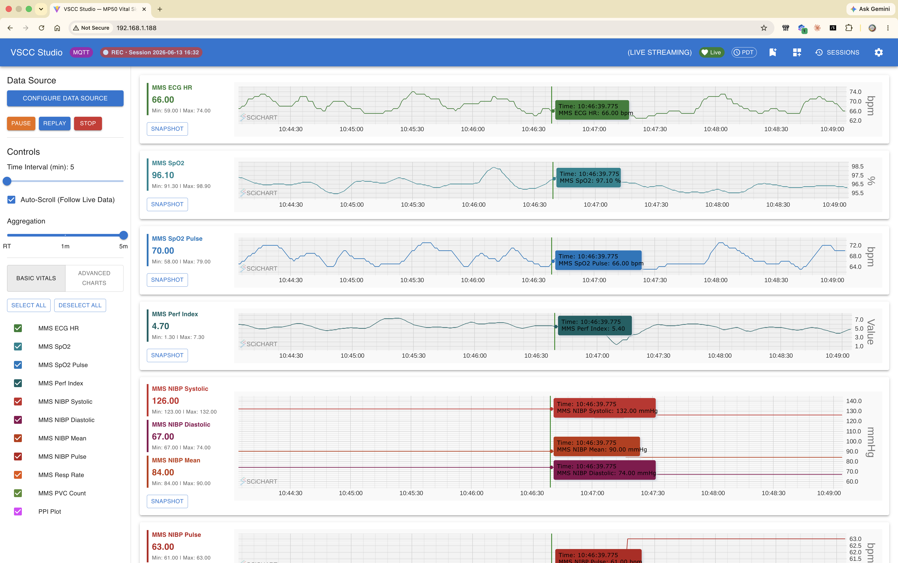
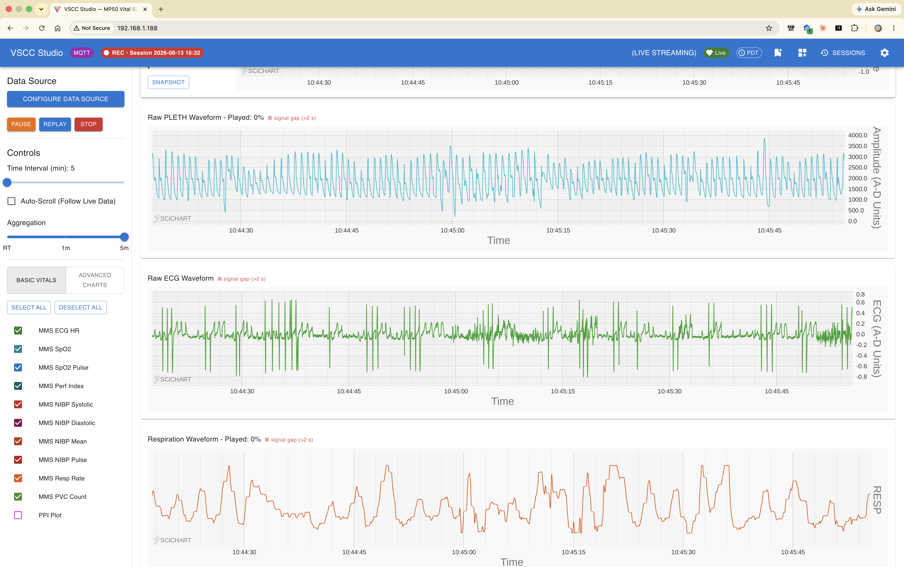

# VSCC Studio

The web frontend of **VSCC** (*VitalSignsCapture + Charts*) — live charting,
session recording, and data export for patient-monitor telemetry.

> [!WARNING]
> **Research and education use only — not a medical device.**
> This software is not cleared or approved for clinical use and must never be used
> for patient monitoring, alarming, or any clinical decision-making. A certified
> monitor remains the source of truth at all times.
>
> **Patient data stays local.** Captured telemetry may constitute Protected Health
> Information (PHI). Never publish it to brokers, dashboards, or endpoints outside
> your controlled network, and never write physiological values into logs, browser
> consoles, or third-party telemetry/analytics services. De-identify any recording
> before sharing it.

Real-time physiological telemetry dashboard for the **Philips MP50** patient monitor.
Captured waveforms and numerics (ECG, SpO₂, Pleth, Respiration, NIBP) are streamed
into a React + [SciChart.js](https://www.scichart.com/) WebGL canvas and rendered at 60 FPS.

This is the **frontend**. It pairs with the
[vscc-mqtt-server](https://github.com/chsbusch-dot/vscc-mqtt-server) backend — an
MQTT (EMQX) + TimescaleDB stack built around
[VSCapture](https://sourceforge.net/projects/vscapture/files/), the open-source
patient-monitor capture tool by John George K. The backend's installer downloads
the latest VSCapture automatically; no separate setup is needed.

<!-- TODO: screenshot pending regeneration for the MMS-only edition — restore once captured:
 -->

---

## Features

- **Live MQTT streaming** over WebSocket (`mqtt` client) with per-channel topic mapping
- **High-frequency waveforms** — Pleth and Respiration rendered as continuous traces, plus ECG channels
- **Numeric vitals** — SpO₂, pulse rate, NIBP (systolic/diastolic/mean), respiration rate, heart rate
- **Multiple data sources** — live MQTT broker, URL polling, and local file upload / replay of recorded exports
- **Synchronized zoom & pan** across all charts (`GlobalSyncGroup`)
- **FIFO-bounded series** so long sessions don't leak memory
- **Auto-scroll / follow-live** toggle, adjustable time window, and per-channel selection

### Sessions, analysis & export
- **Session browser** — recordings are auto-grouped into sessions (named start/stop with subject
  code + notes); load any past session back into the charts, or delete it.
- **Downloads** — per-session or all-sessions ZIP (CSV + Parquet), and **EDF** export for
  EDFbrowser / MNE / biosignal toolchains, all streamed so multi-GB packages never block the browser.
- **Capture-quality view** — per-waveform loss statistics (nominal rate, expected vs actual samples,
  gaps, longest gap).
- **Event annotations** — drop timestamped markers ("intubation", "drug given") and review/delete them.
- **Capture health indicator** — a header chip polling the backend's `/api/status` (live / stalled /
  offline, last-data age, DB lag, per-source clock offset). Observability only — never a clinical alarm.
- **Settings** — data retention, **dashboard-managed capture config** (monitor IP, interval, waveset,
  scale, devid with live recycle), and a **Local / UTC** time-display toggle.

### Waveforms & numerics

<!-- TODO: screenshot pending regeneration for the MMS-only edition — restore once captured:
 -->

> The screenshots above show SpO₂ and pulse trends, a raw plethysmograph pulse waveform, and a
> respiration trace from recorded MP50 data.

---

## Getting started

**Prerequisites:** Node.js 20+ and npm.

```bash
npm install        # install dependencies
npm run dev        # Vite dev server with HMR (binds --host for LAN access)
```

The dashboard defaults to the MQTT broker at `ws://192.168.1.188:8083/mqtt`. Open
**Configure Data Source** in the sidebar to point it at your broker, switch providers
(MQTT / URL / WebSocket / File Upload), and map each waveform to its topic or file.

### Scripts

| Command | Description |
| --- | --- |
| `npm run dev` | Vite dev server with hot reload |
| `npm run build` | Type-check (`tsc -b`) + production build — **the authoritative CI gate** |
| `npm run lint` | ESLint with type-aware rules |
| `npm run test` | Vitest unit tests |
| `npm run preview` | Serve the production build locally |

---

## Data sources

| Provider | How it works |
| --- | --- |
| **MQTT Broker** | Subscribes to per-channel topics (e.g. `mp50/VitalSigns`, `mp50/HF-PLETH`) over WebSocket. High-frequency channels are buffered and flushed in batches. |
| **URL (Polling)** | Periodically fetches a JSON export (e.g. `DataExportVSC.json`) over HTTP. |
| **WebSocket** | Direct WS stream (reserved/experimental). |
| **File Upload** | Replays recorded exports — JSON numerics and chunk-streamed `*WaveExport.csv` waveform files — entirely in the browser. |

Each channel is mapped independently, so you can mix sources (e.g. live MQTT vitals while replaying a recorded waveform).

---

## Architecture

| File | Responsibility |
| --- | --- |
| `src/data/DashboardContext.tsx` | Central state (`useReducer` + Context); default endpoints, channel mappings, toggles |
| `src/data/constants.ts` | `PHYSIO_META` — metadata (label, unit, group, color) for every physiological ID |
| `src/components/Sidebar.tsx` | Data-source controls, channel selection, MQTT/upload connection lifecycle |
| `src/components/DataSourceModal.tsx` | Provider + per-channel topic/file mapping UI |
| `src/components/AppLayout.tsx` | Layout, chart grouping, header (health chip, time-zone chip, Mark-event, Sessions, Settings) |
| `src/components/ChartContainer.tsx` | Primary waveform rendering (gold-standard SciChart lifecycle) |
| `src/components/AdvancedCharts.tsx` | Raw Pleth / Respiration waveform charts |
| `src/hooks/useSciChart.ts` | SciChart surface lifecycle hook |
| `src/utils/dataParser.ts` | JSON export → `TelemetryRecord[]` parsing |
| `src/components/SessionsDrawer.tsx` | Session browser — load / download / quality / delete, signals legend |
| `src/components/SettingsDialog.tsx` | Retention, capture config, Local/UTC time toggle |
| `src/components/SessionQualityDialog.tsx` | Per-waveform loss statistics + EDF download |
| `src/components/AnnotationsDialog.tsx` | Add / list / delete event markers |
| `src/components/HealthIndicator.tsx` | Capture-health header chip (polls `/api/status`) |
| `src/data/sessionsApi.ts` | Typed REST client for sessions, quality, annotations, status, capture-config |

**Stack:** React 19 · TypeScript 5.9 · Vite 7 · SciChart.js 5 · MUI 7 · mqtt.js 5.

---

## ⚠️ The imperative chart boundary

`ChartContainer.tsx`, `AdvancedCharts.tsx`, and `useSciChart.ts` form an **imperative WebGL boundary**
and are intentionally exempt from some React/ESLint rules. When working in these files:

- **Do not** put chart data in `useState` or add chart variables to `useEffect` dependency arrays.
- **Do not** remove the intentional ESLint overrides (`react-hooks/exhaustive-deps`, `react-hooks/purity`,
  `@typescript-eslint/no-floating-promises`) — they protect the chart lifecycle.
- **Do not** enable React `StrictMode` — SciChart WebGL contexts are limited (~8–16 per browser) and
  double-mounting destroys the app.
- **Do** use `appendRange()` for streaming, set `fifoCapacity` on real-time series, and normalize the
  X-axis to Unix epoch **seconds** (`Date.getTime() / 1000`).

---

## SciChart license

SciChart Community Edition expires every **6 months** and charts will show a license error after expiry. Refresh with:

```bash
npm install scichart@latest && npm install
```

---

## ⚖️ HIPAA Compliance Disclaimer

This system is architected to process medical telemetry containing **electronic Protected Health Information (ePHI)**.

While the software contains controls to support **HIPAA compliance**, deploying this code does not automatically guarantee compliance. Users are strictly responsible for:
* Configuring secure infrastructure and encryption at rest/in transit.
* Disabling verbose console logging (`console.log`) in production to prevent leaking raw physiological payloads.
* Executing their own Business Associate Agreements (BAAs) with hosting providers.
